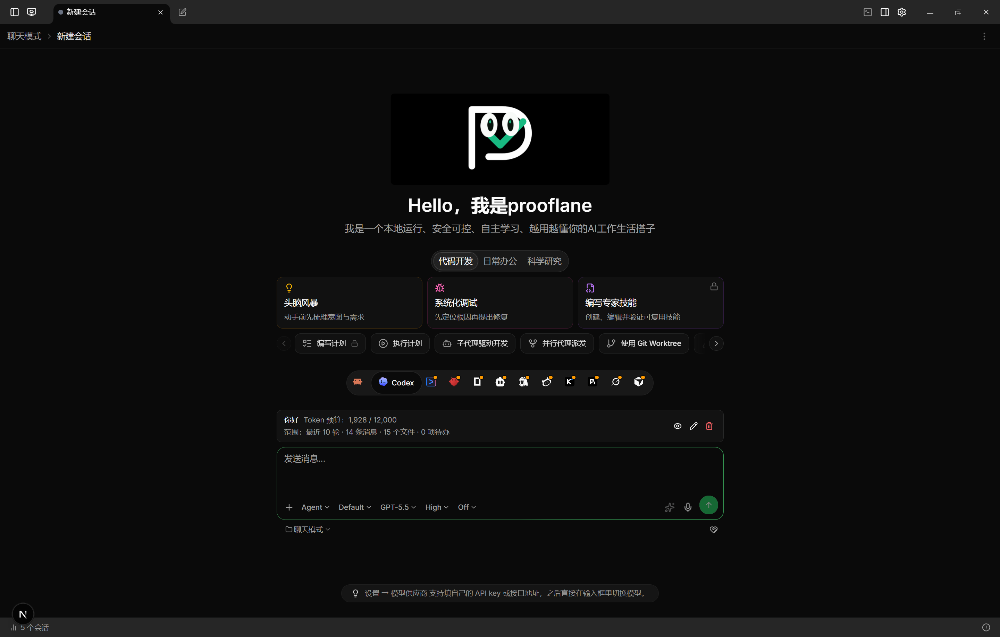
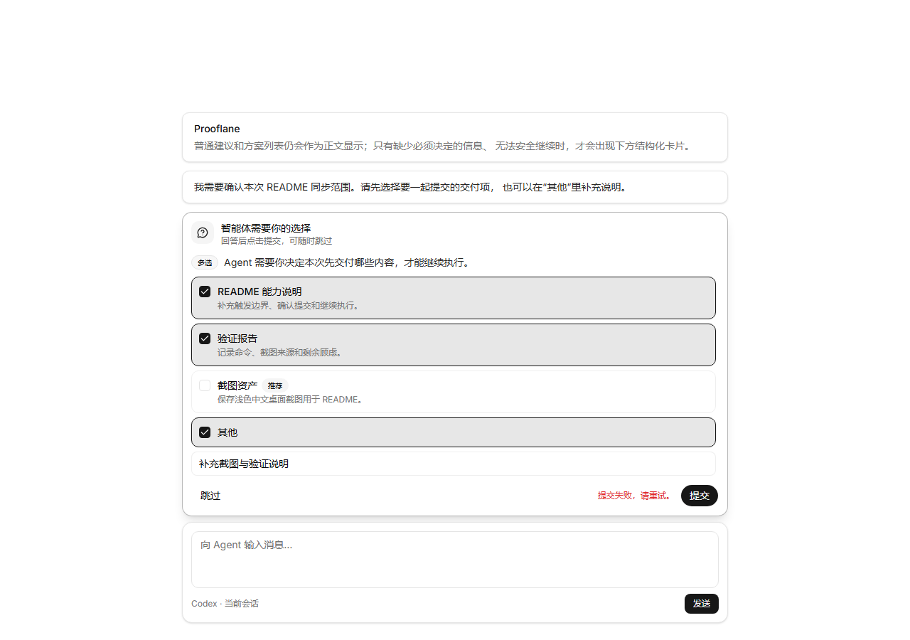

# Prooflane

<p align="center">
  
</p>

<p align="center"><strong>VERIFY THE DELIVERY</strong></p>

[](https://github.com/xuhengmao/prooflane/releases)
[](./LICENSE)

Prooflane 是证据驱动的 AI 工程交付工作台。项目基于
[Codeg](https://github.com/xintaofei/codeg) `0.24.0` 演进，在保留多智能体编码工作区能力的同时，逐步加入任务合同、验收标准、验证证据、质量门禁和可审计交付流程。

Prooflane 当前版本为 `0.24.1-rc.1`。下文将 Codeg `0.24.0` 的继承能力与 Prooflane 已实现能力分开说明。

## 产品方向

Prooflane 不把“智能体回复结束”当作“任务完成”。目标流程是：

```text
需求 -> 规格 -> 实现 -> 验证 -> 审查 -> 有证据的交付
```

核心方向：

- 多智能体统一接入和协作。
- 目标、范围、约束和验收标准结构化。
- 测试、构建、代码审查、截图和日志自动形成证据。
- 高风险操作人工审批，阶段转换受质量门禁约束。
- 工作流、上下文包和团队最佳实践可复用。

## Codeg 继承能力

从 Codeg `0.24.0` 继承的主要能力包括：

- Claude Code、Codex CLI、OpenCode、Gemini CLI、OpenClaw、Cline 等智能体接入。
- 多智能体委托、会话聚合、工作区、终端、Git 和 Worktree。
- Tauri 桌面应用、Rust/Axum 服务端和 Docker 部署。
- 自动化、技能包、远程工作区、备份恢复和多语言界面。
- Next.js 16 + React 19 前端，SeaORM + SQLite 数据层。

## Prooflane 已新增能力

### 可控会话连续性

会话接力让新草稿或新会话在明确授权后接入一个历史会话的必要上下文。它是**主动接力**：普通新会话默认不会读取全部历史会话，也默认不会写入长期记忆。接力可跨智能体使用，并提供范围预览、Token 预算和来源追溯。

用户可见的接力体验包括：长标题仍可安全选择；预览按“你 / AI”、工具、文件和摘要呈现，而不暴露内部协议；右键“在新会话中继续”会显示准备、失败或重试状态。初次预览、草稿恢复或来源读取失败时可重试、移除或重新准备，不会静默降级为普通发送。来源轮次、目标模型或预算变化会保留接力卡片并要求重新准备，发送结果不确定时会阻止隐藏上下文被错误复用。预算超限可直接缩小范围，多窗口修改或应用意外退出后会从本地持久化状态恢复且不会自动重复任务；历史扫描、侧栏和会话详情只按数据库授权快照隐藏内部接力文本，用户自己输入的相似内容保持原样。



使用流程：

1. 选择来源：从当前项目或全部项目选择一个历史会话。
2. 检查范围与预算：选择最近轮次、自定义轮次或摘要，并在发送前检查范围预览与 Token 预算。
3. 发送后查看来源：新会话会显示来源追溯，可检查接入范围与快照元数据。

### 结构化决策卡片

当支持结构化提问的 Agent 缺少必须由用户决定的选项或信息，并且无法安全继续时，Prooflane 会把支持的原生提问（例如 Codex `request_user_input`、Grok 原生提问）或已启用的 `ask_user_question` 转为输入框上方的结构化决策卡片，而不是要求用户手工回复 A/B/C。`ask_user_question` 默认开启；MCP 会话初始化时会明确要求 Agent：凡是需要用户在两个或以上明确选项中做阻塞决策，必须调用该工具，不能只在正文列出 A/B/C、数字或标签。普通建议、方案列表和可合理默认或推断的内容仍保持正文显示；Prooflane 不会把任意 Markdown 列表猜测成选择题，避免误渲染。这里依赖 Agent/宿主是否真的上报结构化问题，不保证所有第三方自定义 Agent 都支持。

卡片支持单选、多选、宿主自动补出的“其他”输入，以及 `options=[]` 的无预设选项自由输入。用户可以先修改所有选择和补充文本，点击“确认”后才一次性提交；提交失败会保留已选内容和输入内容并允许重试，提交成功后 Agent 会从原阻塞点继续执行。



### 本地设计资产与工作台外壳

Prooflane 已提供原生“AI 设计”一级入口和第一批本地设计能力。用户无需先选择项目即可创建页面、组件、图片、图标、设计系统或流程草稿；设计资产与不可变修订保存在本地 SQLite 中，可搜索和筛选，并支持打开、重命名、复制、归档、恢复和软删除。

打开设计后会进入固定工作台外壳，包含设计/原型/运行视图、图层/资产/组件/变量面板、属性区、稳定画布宿主和 AI Composer 宿主。`Ctrl/Cmd+S` 会创建新修订，并通过乐观并发检测防止静默覆盖；应用会恢复最近打开的设计、视图、面板折叠和画布缩放状态，但不会把设计正文复制到浏览器存储。

当前已交付 `DES-1A.1` 工作台与存储基线、`DES-1A.2` SVG 画布基础闭环，以及 `DES-1A.3` 基础导航。空白设计会生成 `1440 × 900` 的本地模板（Frame、背景矩形和标题文本）；DesignDocument 会在打开和保存时执行归一化与校验。画布支持 Frame、矩形、文字、图片及缺失图片占位的 SVG 渲染，并支持鼠标/键盘选择、锁定节点保护、属性编辑、拖拽移动和统一 viewBox 坐标换算。导航支持以光标为锚点的滚轮缩放、空格/中键平移、键盘 `+/-/0`、适配画布和重置视图；视口变化不会修改设计节点或 revision。`Ctrl/Cmd+S` 会保存当前文档，保存前校验数据，revision 冲突或保存失败时保留本地编辑，不静默覆盖远端版本。

这仍不是完整专业画布。独立画布窗口、PNG/SVG/PDF 导出、CanvasKit 正式主渲染、框选/空间索引/万级节点性能门禁、组件与变量、AI Composer 的真实模型调用、可执行原型、Design → Code 和项目实现关联仍按 `DES-1A.4` 及后续阶段交付；当前相关入口保持禁用或明确标注为后续能力。

## 路线图

- 长期记忆：计划在后续阶段设计为可审计、可控制的独立能力；当前尚未作为现有能力提供。
- AI 设计工作台：`DES-1A.1` 已建立本地设计资产、不可变修订和工作台外壳，`DES-1A.2` 已完成 SVG 画布基础闭环，`DES-1A.3` 已完成基础 viewBox 导航；CanvasKit、专业命中/性能、组件/变量、AI 生成和设计到开发闭环继续按专项路线分期交付。

## 开发环境

- Node.js 20+
- pnpm `11.9.0`
- Rust stable
- Windows：Visual Studio C++ Build Tools、WebView2

安装依赖：

```powershell
pnpm install --frozen-lockfile
```

启动 Web 开发模式：

```powershell
pnpm dev
```

启动桌面开发模式：

```powershell
pnpm tauri dev
```

## 检查与构建

```powershell
pnpm lint
pnpm test
pnpm build

cd src-tauri
cargo check --locked
cd ..

pnpm tauri build --bundles nsis
```

服务端仍保留兼容二进制名：

```powershell
pnpm server:build
```

## 发布与更新

桌面和服务端更新从以下仓库发布：

```text
https://github.com/xuhengmao/prooflane/releases
```

GitHub Actions 需要以下仓库 Secrets：

- `TAURI_SIGNING_PRIVATE_KEY`
- `TAURI_SIGNING_PRIVATE_KEY_PASSWORD`

私钥和密码不得提交到 Git。Tauri 配置中只允许保存公钥。

## 兼容说明

首阶段仅迁移产品品牌和发布身份。为避免破坏已有数据、协议和备份，以下内部名称暂时保留：

- `codeg-server`、`codeg-mcp`、`codeg_lib`
- `CODEG_*` 环境变量
- `~/.codeg` 数据目录
- `codeg://` 内部引用协议

后续迁移必须采用双读、数据迁移和明确废弃周期，不能全局替换。

## 上游与许可

Prooflane 基于 Codeg `0.24.0` 二次开发。感谢 Codeg 作者和贡献者提供的基础工程。

本仓库遵循 [Apache License 2.0](./LICENSE)。二次分发和商业使用时仍需遵守原许可证中的版权、许可和 NOTICE 要求。
